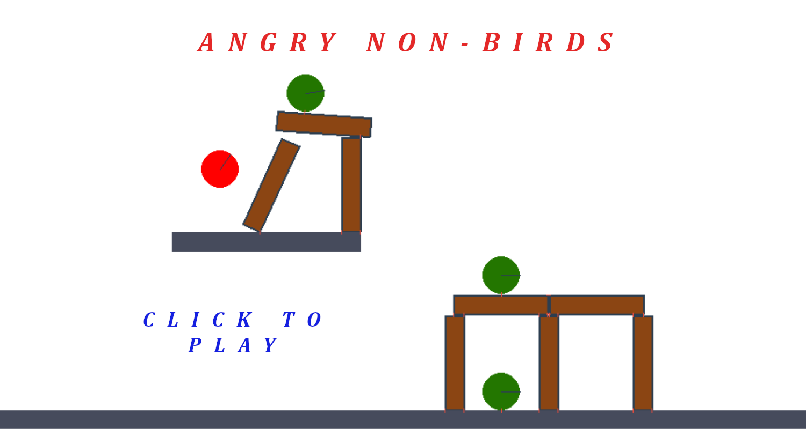
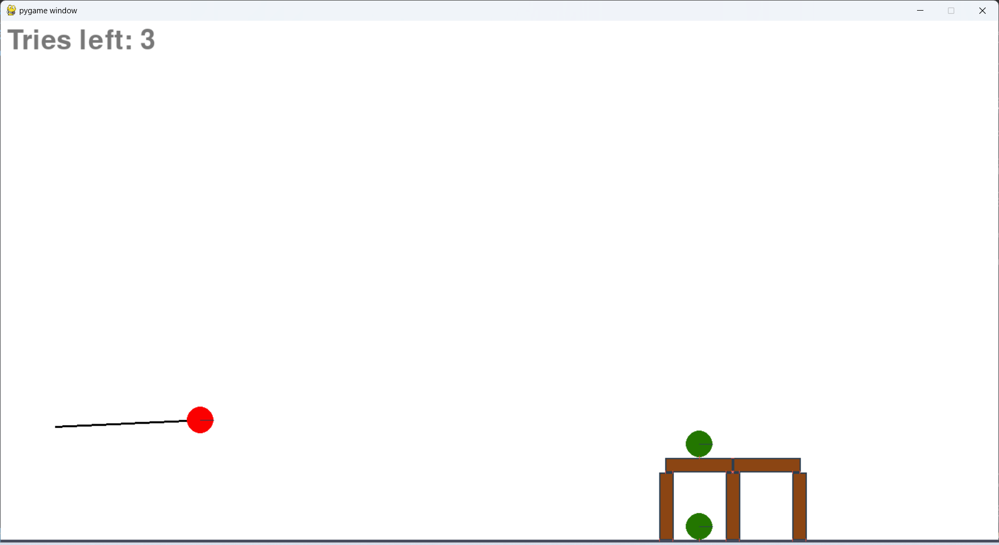
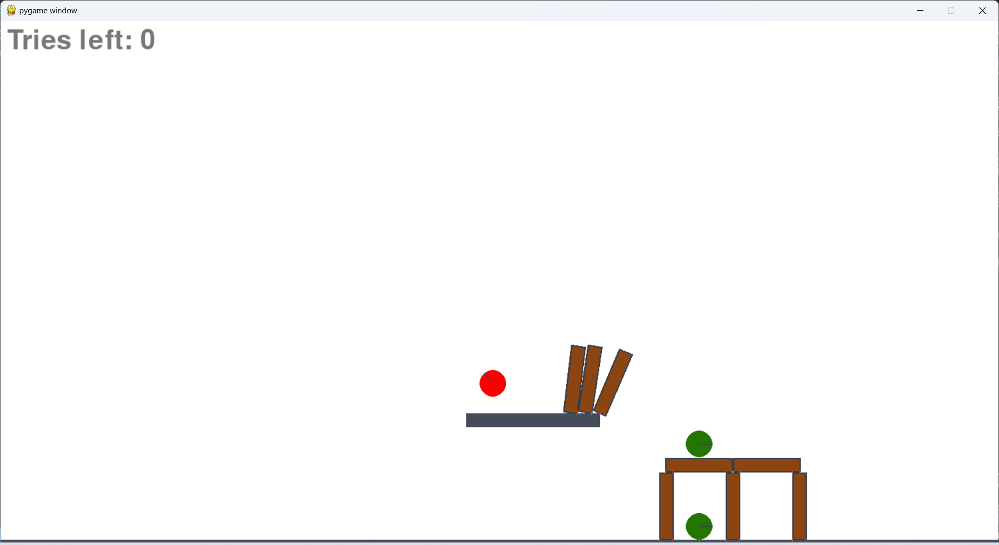

# Angry non-Birds

## Description
Simple clone of *Angry Birds* game.

Written in `Python` using `Pygame` and `Pymunk`.

It was written in the first semester (2022Z) as a project for the course *Basics of computer science and programming (PIPR)* at the Warsaw University of Technology.

## Getting started
1. Clone the repository
2. Create and activate virtual environment
    - Unix:
        ```
        python3 -m venv venv
        source venv/bin/activate
        ```
    - Windows:
        ```
        python -m venv venv
        venv\Scripts\activate
        ```
3. Download required modules
    ```
    pip install -r requirements.txt
    ```
4. Start the game
    - Unix:
        ```
        python3 main.py
        ```
    - Windows:
        ```
        python main.py
        ```
5. Deactivate virtual environment
    ```
    deactivate
    ```

## User manual



With a click of the mouse button, the user begins the procedure of selecting the power and angle of projectile launch. The black line represents the direction and pulling power. Clicking again fires the bullet.



Targets directly hit are immediately removed. Obstacles hit are not removed, but fall over. They can thus hit the target and if the kinetic energy is large enough, the target will be removed. An analogous 
principle takes place when the target collides with a static boundary object.



Another click removes the projectile and the objects that flew out of the simulation boundary. 


## Potential improvements
- [ ] loading and parsing levels e.g. from external file (adding new levels would be simplified)
- [ ] fixing the friction force impact on objects in the physics simulation (objects roll endlessly)
